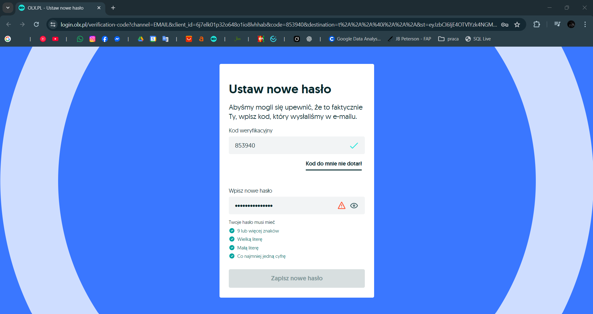

# BUG-003 – No trimming of new password during reset flow

**Project:** OLX.pl  
**Module / Component:** Authentication → Forgot Password → New password setup  
**Bug type:** Usability / Input sanitization  
**Reported:** 2026-02-01  
**Related test case:** TC-FORGOT-007 (New password with leading/trailing spaces)  
**Environment:**
- Browser: Chrome 131 (latest)
- OS: Windows 11
- Resolution: 1920×1080
- Device: Desktop
- User state: Logged out (during reset flow)

**Steps to Reproduce:**
1. Request a password reset using a valid email (as in TC-FORGOT-001)  
2. Open the received reset link  
3. On the new password form, enter a password with leading and/or trailing spaces  
   (e.g. "  NoweHaslo2026!  ")  
4. Confirm the same password (with spaces)  
5. Click "Zapisz" / "Zmień hasło"

**Actual Result:**
- Error message appears (e.g. "Hasło musi zawierać co najmniej jedną wielką literę..." or similar validation failure)  
- Password change is blocked  
- Spaces are **not** trimmed – they are treated as part of the password string  
- No password is updated

**Expected Result (industry best practice):**
- Leading and trailing spaces are automatically trimmed from the password  
- Password is saved without extra spaces (as "NoweHaslo2026!")  
- Change succeeds (assuming the trimmed password meets all other rules)  
- User can log in with the trimmed version  
- No error message related to invalid characters (if the core password is valid)

**Severity:** Minor (Usability / Cosmetic)  
Does not break core functionality, but causes unnecessary failures for common copy-paste scenarios (e.g. from password managers, notes, mobile keyboards).

**Priority:** Medium  
Improves user experience, reduces support tickets, aligns with major platforms (Google, Facebook, Microsoft – all trim passwords on reset/login).

**Attachments / Evidence:**
-   
  *Shown: validation error despite valid core password (spaces cause failure)*

-   
  *Shown: user entered password with visible leading/trailing spaces*

