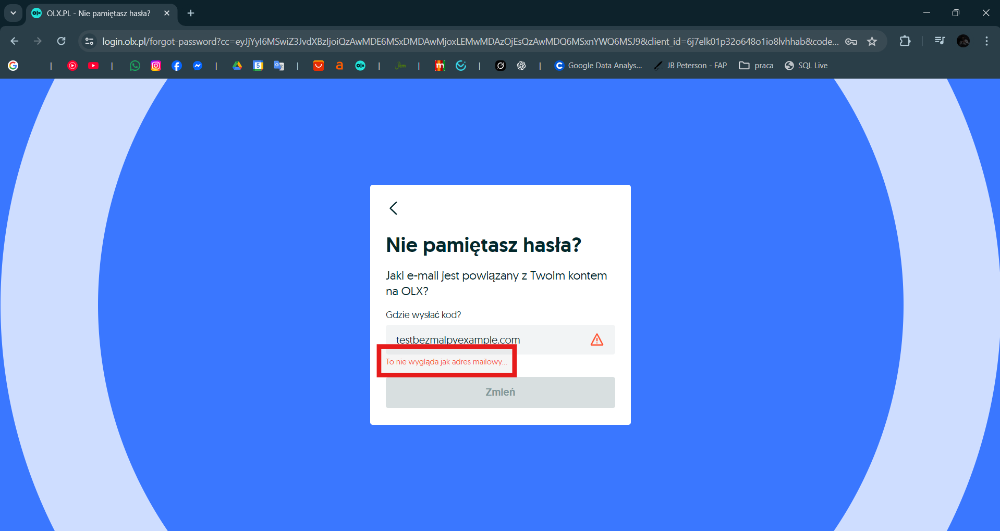
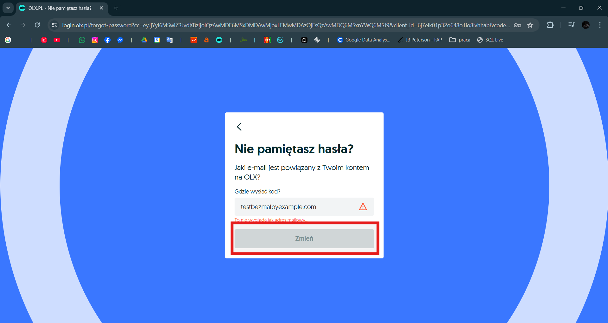

# TC-FORGOT-003 – Request password reset with invalid email format

**Project:** OLX.pl  
**Module / Component:** Authentication → Forgot Password → Email validation  
**Type:** Negative  
**Priority:** High  
**Preconditions:**  
- Forgot password form is open  
- User is logged out  
- Browser in normal mode (no extensions blocking validation)

**Test Data:**  
- Email (invalid): testbezmalpyexample.com (missing @ symbol)  
- Email (alternative invalid): test@ (missing domain)

**Steps to Reproduce:**
1. Go to https://www.olx.pl  
2. Click "Twoje konto" in the top-right corner  
3. Select "Zaloguj się"  
4. Click "Nie pamiętam hasła" link/button  
5. In the email field enter an invalid format (e.g. testbezmalpyexample.com)  
6. Attempt to click "Wyślij link" / "Resetuj hasło"

**Expected Result:**
- Client-side validation prevents submission (button disabled or inline error appears immediately)  
- Error message shown next to the field (e.g. "To nie wygląda jak adres mailowy..." or "Nieprawidłowy format e-mail")  
- No server request is sent  
- Form remains open, no success message or email sent

**Actual Result:** (during test)  
Inline error appeared immediately: "To nie wygląda jak adres mailowy...".  
"Wyślij link" button remained disabled / greyed out until corrected.  
No request sent to server, no email generated. Correct client-side validation.

**Status:**  
✅ Passed

**Tested on:** 2026-02-01  
**Browser / OS / Device:** Chrome 131 | Windows 11 | Desktop 1920×1080 

**Attachments / Evidence:**  
-   
-   
